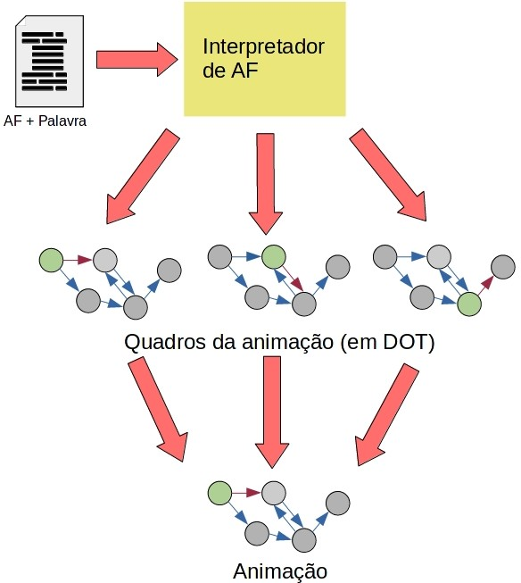

# Animador de AFDs

**Sumário:**

- [Animador de AFDs](#animador-de-afds)
  - [Exemplo de um arquivo de entrada](#exemplo-de-um-arquivo-de-entrada)
  - [Considerações](#considerações)
  - [Exemplo de um grafo de saída](#exemplo-de-um-grafo-de-saída)
  - [Comandos úteis](#comandos-úteis)
    - [Atalhos shell](#atalhos-shell)
    - [Instalação e configuração no LINUX](#instalação-e-configuração-no-linux)
  - [Programas necessários](#programas-necessários)


<br/>
<br/>
<br/>

## Exemplo de um arquivo de entrada
<pre>
s0 ; s2
s0 a > s0
s0 b > s1
s1 a > s1
s1 b > s2
s2 a > s2
s2 b > s2
wrd : aabb
</pre>

**Lambda** será representado por /

## Considerações

1. O programa deve elaborar o AFD e AFN equivalente a esta entrada e então, analisar a palavra, também definida no arquivo.
2. O simulador vai executar passo a passo, i.e, uma transição por vez
3. Antes de passar ao próximo passo, o simulador poderá gerar um arquivo dot com base no estado atual.
4. A ferramenta deverá ser por **linha de comando**, onde irá aceitar um arquivo como parâmetro.


## Exemplo de um grafo de saída

O arquivo dot gerado irá conter todo o grafo, alterando apenas a cor (posição) do estado atual, e a seta indicando o próximo estado, ou seja, ele deverá analisar 1 posição à frente.

<p align="center">
  
  <h4 align="center">
    Figura 1 - Imagem ilustrativa do grafo de saída
  </h4>
</p>


## Comandos úteis

### Atalhos shell
```bash
# limpa a pasta dot/
./clear_outputs

# gera uma imagem para cada arquivo dot dentro da pasta dot/ e, em seguida, gera o gif de todas as imagens
./to_file
```

### Instalação e configuração no LINUX
```bash

# Para gerar um arquivo JPEG:
dot −Tjpeg fonte.dot -o saida.jpg

# Para gerar um gif de todas as imagens geradas
convert -delay 60 -loop 0 *.jpg output.gif

# Para instalar:
sudo apt install build-essential imagemagick graphviz
```

## Programas necessários
- [Graphviz](https://graphviz.org/)
  - [Documentação da linguagem dot](https://graphviz.org/pdf/dotguide.pdf)
  ```dot
  digraph G {
    rankdir=LR;
    overlap="scale";
    sep="0.1";
    pad="1";
    nodesep="0.5";
    ranksep="1";
    node [style="rounded,filled"]

    s0 [color="#467050", fontcolor="white"]
    s2 [peripheries=2]

    start [label= "", shape=none,height=.0,width=.0]
    start -> s0

    s0 -> s1 [label="b"]
    s0 -> s0 [label="a", color="#ad2a2a"]
    s1 -> s1 [label="a"]
    s1 -> s2 [label="b"]
    s2 -> s2 [label="a"]
    s2 -> s2 [label="b"]
  }
  ```
- [Imagemagick](https://imagemagick.org/index.php)
