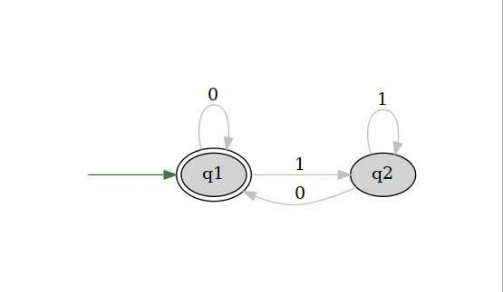
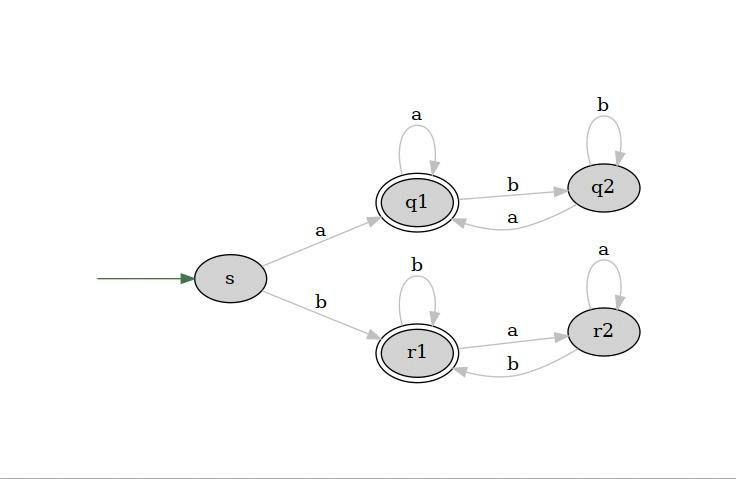
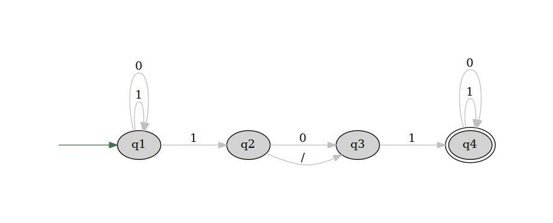

# Animador de AFDs

TODO: do jeito que está atualmente, só aceita AFD.

**Sumário:**

- [Animador de AFDs](#animador-de-afds)
  - [Definição de um AF](#definição-de-um-af)
    - [1. AFD](#1-afd)
      - [1.1 Definição](#11-definição)
      - [1.2 Exemplos](#12-exemplos)
    - [2. AFN](#2-afn)
      - [2.1 Definição](#21-definição)
      - [2.2 Exemplos](#22-exemplos)
  - [Exemplo de um arquivo de entrada](#exemplo-de-um-arquivo-de-entrada)
  - [Considerações](#considerações)
  - [Exemplo de um grafo de saída](#exemplo-de-um-grafo-de-saída)
  - [Comandos úteis](#comandos-úteis)
    - [Atalhos shell](#atalhos-shell)
    - [Instalação e configuração no LINUX](#instalação-e-configuração-no-linux)
  - [Programas necessários](#programas-necessários)
  - [Imagens geradas](#imagens-geradas)
    - [AFD](#afd)
    - [AFN](#afn)
  - [Referências](#referências)


<br/>
<br/>
<br/>

## Definição de um AF

### 1. AFD
#### 1.1 Definição
Segundo <cite>Sipser</cite> [[1](#sipser)], um automâto finito determinístico é dado por uma quíntupla $(Q,\Sigma,\delta,q_0,F)$,
onde:
- Q é um *set* finito de estados
- $\Sigma$ é um *set* finito de símbolos (alfabeto)
- $\delta: Q \times \Sigma \rightarrow Q$ é a função de transição (que relaciona estados utilizando os símbolos)
- $q_0 \in Q$ é o estado inicial
- $F \subseteq Q$ é o *set* de estados aceitáveis (finais)

Resumidamente, isso implica que todo AFD deverá "consumir" o
símbolo durante a transição, de forma que, caso não o faça, será
inválido.

Note que, de acordo com a definição, somente é possível existir
um único símbolo de entrada

#### 1.2 Exemplos
<p align="center">
  
  <h5 align="center">Exemplo 1.9 do livro</h5>
</p>
<p align="center">
  
  <h5 align="center">Exemplo 1.11 do livro</h5>
</p>

### 2. AFN
#### 2.1 Definição

Usando a definição do livro:
> A ***nondeterministic finite automaton*** is a 5-tuple $(Q,\Sigma, \delta, q_0, F)$ where:
> 1. Q is a finite set of states,
> 2. $\Sigma$ is a finite alphabet,
> 3. $\delta: Q\times \Sigma_\epsilon \rightarrow P(Q)$ is the transition function,
> 4. $q_0\in Q$ is the starte state, and
> 5. $F \subseteq Q$ is the set of accept states.
>
> -- <cite>Sipser</cite> [[1](#sipser)]

Novamente, isto implica em dizer que haverá apenas **um único
estado inicial**.

Note que poderá existir uma transição $\lambda$ - ou $\epsilon$,
de acordo com o autor -, essa transição implica em dizer que
irá ocorrer a transição de estados, entretanto, **não irá ocorrer
o consumo** imediato da chave.

Uma outra característica do **AFN**, é que ele pode ter a mesma aída (arestas) para dois, ou mais, nós distintos.


#### 2.2 Exemplos

<p align="center">
  
  <h5 align="center">Exemplo 1.41 do livro.</h5>
</p>

<p align="center">
  
  <h5 align="center">Exemplo retirado da <a href="http://eaulas.usp.br/portal/video.action?idItem=17134">internet</a></h5>
</p>

## Exemplo de um arquivo de entrada

Um arquivo de entrada deverá ser formatado como o código abaixo. Isso implica em dizer, que deverá haver
espaços separando símbolos/estados.

<pre>
s0 ; s2
s0 a > s0
s0 b > s1
s1 a > s1
s1 b > s2
s2 a > s2
s2 b > s2
wrd : aabb
</pre>

**Lambda** será representado por /

## Considerações

1. O programa deve elaborar o **AFD** e **AFN** equivalente a esta entrada e então, analisar a palavra, também definida no arquivo.
2. O simulador vai executar passo a passo, i.e, uma transição por vez
3. Antes de passar ao próximo passo, o simulador poderá gerar um arquivo dot com base no estado atual.
4. A ferramenta deverá ser por **linha de comando**, onde irá aceitar um arquivo como parâmetro.


## Exemplo de um grafo de saída

O arquivo dot gerado irá conter todo o grafo, alterando apenas a cor (posição) do estado atual, e a seta indicando o próximo estado, ou seja, ele deverá analisar 1 posição à frente.

<p align="center">
  
  <h4 align="center">
    Imagem ilustrativa do grafo de saída
  </h4>
</p>


## Comandos úteis

### Atalhos shell

* Como rodar algum programa:

```bash
# executando um arquivo de exemplo sobre a pasta inputs ...
# ... dentro da pasta afdn_animator (pasta com os códigos), digite
./target/release/afdn_animator ./inputs/default.txt

# em seguida, gere as imagens com base nos arquivos dots, dentro da pasta ...
# ... o jeito mais rápido é digitar
./to_file

# por fim, caso seja necessário (ou vá rodar outro teste), remova os arquivos antigos
./clear_outputs
```
> Note que a build atual foi feita no LINUX e PARA O LINUX, portanto, caso use windows,
> será necessário realizar a build de produção novamente

> Note também que, os scripts foram feitos para o bash, dessa forma, caso utilize-os no windows
> ou terá que ser feita uma adaptação para arquivos .bat ou utilizar o WSL2

* Outros comandos úteis:
```bash
# dev build
cargo build

# Production build
cargo build --release

# limpa a pasta dot/
./clear_outputs

# gera uma imagem para cada arquivo dot dentro da pasta dot/ e, em seguida, gera o gif de todas as imagens
./to_file
```

### Instalação e configuração no LINUX
```bash

# Para gerar um arquivo JPEG:
dot −Tjpeg fonte.dot -o saida.jpg

# Para gerar um gif de todas as imagens geradas
convert -delay 60 -loop 0 *.jpg output.gif

# Para instalar:
sudo apt install build-essential imagemagick graphviz
```

## Programas necessários
- [Graphviz](https://graphviz.org/)
  - [Documentação da linguagem dot](https://graphviz.org/pdf/dotguide.pdf)

  Exemplo de um arquivo dot gerado
  ```dot
  digraph G {
    rankdir=LR;
    overlap="scale";
    sep="0.1";
    pad="1";
    nodesep="0.5";
    ranksep="1";
    node [style="rounded,filled"]

    s0 [color="#467050", fontcolor="white"]
    s2 [peripheries=2]

    start [label= "", shape=none,height=.0,width=.0]
    start -> s0

    s0 -> s1 [label="b"]
    s0 -> s0 [label="a", color="#ad2a2a"]
    s1 -> s1 [label="a"]
    s1 -> s2 [label="b"]
    s2 -> s2 [label="a"]
    s2 -> s2 [label="b"]
  }
  ```
- [Imagemagick](https://imagemagick.org/index.php)


## Imagens geradas

### AFD
<p align="center">
  
  <h4 align="center">
    Exemplo do enunciado. Palavra: aabb
  </h4>
</p>

<p align="center">
  
  <h4 align="center">
    Exemplo 1.9. Palavra: 0000110
  </h4>
</p>

<p align="center">
  
  <h4 align="center">
    Exemplo 1.11. Palavra: aba
  </h4>
</p>

### AFN

<p align="center">
  
  <h4 align="center">
    Exemplo 1.41. Palavra: baaba
  </h4>
</p>

<p align="center">
  
  <h4 align="center">
    Exemplo da internet. Palavra: 0011
  </h4>
</p>

<p align="center">
  
  <h4 align="center">
    Exemplo 1.41. Palavra: vazia
  </h4>
</p>

<br/>
<br/>

---

<!-- Referências e links -->
## Referências

<i id="sipser"></i>
1. Introduction to the theory of computation. Michael Sipser. 2ª ed. 2005. MIT. Thomsom. ISBN 0-534-95097-3.
